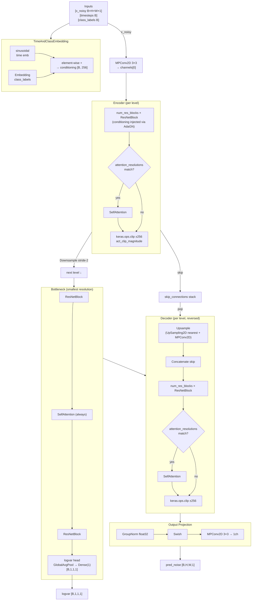
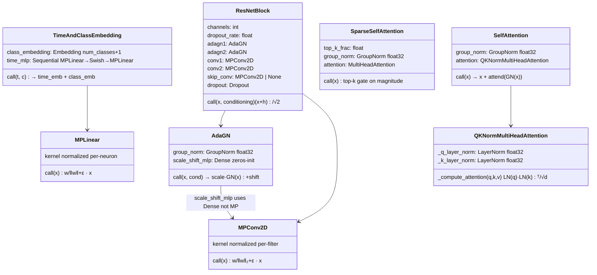
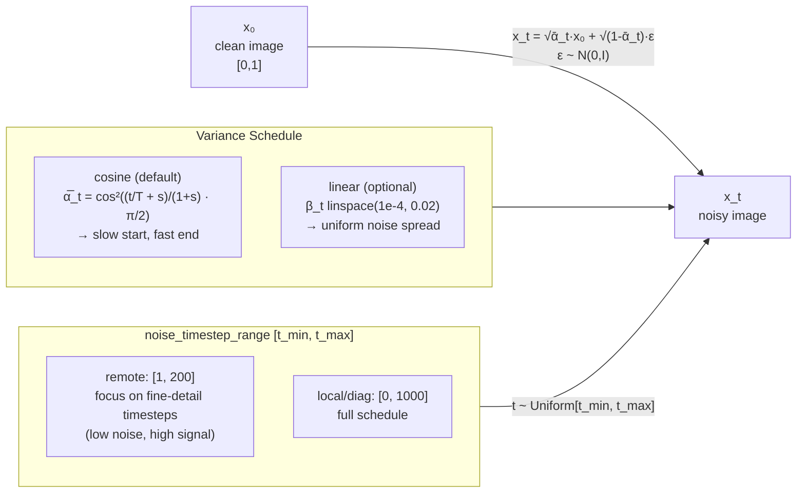
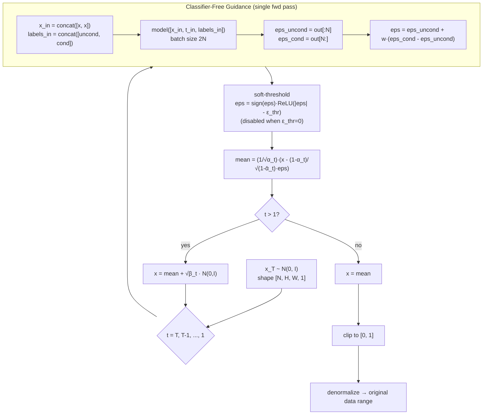

# Diffusion Model Architecture Reference

Hierarchical design summary for the conditional DDPM implementation with classifier-free guidance. Documents the *why* behind each non-obvious design decision, with links to the exact code locations.

---

## 1. Top-Level Pipeline

```mermaid
flowchart TD
    A[GTEx raw data\nRNA-seq + phenotypes] --> B[preprocessing/\nprepare_training_data.py]
    B --> C[(output/preprocessing/\nresized_expressions.npy\ny_primary_disease_or_tissue.npy)]

    C --> D[diffusion_train.py\ntrain&#40;config&#41;]
    D --> E[forward_transform\nnormalize to 0,1]
    E --> F[prepare_dataset_conditional\nforward diffusion + CFG dropout]
    F --> G[train_step loop\n500k steps remote / 1k local]
    G --> H[EMA shadow update]
    H --> G
    G -->|save_interval| I[(checkpoint_dir/\ndiffusion_model_step_N.weights.h5\n+ .ema.npz)]
    G -->|sample_interval| J[generate_samples\nDDIM 20 steps]
    J --> K[(sample_dir/\nsamples_step_N.png)]

    I --> L[diffusion_sample.py\nload_model&#40;&#41;]
    L --> M[sample_ddpm_batch\nor sample_ddim_batch]
    M --> N[(output/diffusion/\ndiffusion_synthetic_expressions.npy)]

    style C fill:#e8f4fd
    style I fill:#e8f4fd
    style K fill:#e8f4fd
    style N fill:#e8f4fd
```



**Key references:** [`diffusion_config.py:52–57`](diffusion_config.py#L52) (path config), [`diffusion_train.py:531`](diffusion_train.py#L531) (`train()`), [`diffusion_sample.py:341`](diffusion_sample.py#L341) (`load_model()`)

---

## 2. Model Architecture

### 2a. U-Net Data Flow



**Reference:** [`diffusion_model.py:527–635`](diffusion_model.py#L527) (`build_unet()`)

---

### 2b. Layer Component Hierarchy



---

### 2c. Design Choices: Model Layer Level

#### MPConv2D / MPLinear — Magnitude-Preserving Weights

**Problem:** Conv/linear weight magnitude grows during training, amplifying activations layer-by-layer. Observed as decoder activation explosion in diagnostic runs (mean activation 4.2 → 23.6 at step 1600).

**Fix (EDM2 Config D, §B.4):** Normalize each output filter to unit L2 norm *on every forward pass*. The raw parameter trains normally; normalization is applied in `call()`.

```python
# diffusion_model.py:470–475
w = tf.cast(self.kernel, tf.float32)
w_flat = tf.reshape(w, [-1, self.filters])
w_norm = w_flat / (tf.norm(w_flat, axis=0, keepdims=True) + 1e-4)
w_norm = tf.reshape(w_norm, self.kernel.shape)
w_norm = tf.cast(w_norm, x.dtype)
```

**Result:** Output magnitude is bounded by input magnitude regardless of how large `kernel` grows.

---

#### MP Residual — Variance-Preserving Skip Connections

**Problem:** `x + h` where both paths have similar variance doubles the output variance per block. After N blocks, variance scales as 2^N.

**Fix:** `(x + h) * (2.0 ** -0.5)` preserves expected magnitude when both paths have similar variance.

```python
# diffusion_model.py:160
return (x + h) * (2.0 ** -0.5)
```

---

#### AdaGN with Zero-Init — Stable Conditioning at Init

**Problem:** If `scale_shift_mlp` starts with random weights, `scale_raw` is a random multiplier on every feature map from step 0. This destabilizes training before the conditioning has any meaning.

**Fix (DiT adaLN-Zero pattern):** `kernel_initializer='zeros'` means `scale_raw = 0` at init, so `scale = 1` (passthrough). Conditioning earns its influence via gradients.

```python
# diffusion_model.py:59–65
self.scale_shift_mlp = layers.Dense(
    self.channels * 2,
    kernel_initializer='zeros',
)
```

---

#### QKNormMultiHeadAttention — Preventing Attention Logit Explosion

**Problem:** Q and K projection weights grow alongside activations. Attention logits scale as `‖W_q‖ · ‖W_k‖` (quadratic with weight magnitude), pushing softmax toward a hard argmax that zeroes attention gradients. Observed directly at step 1600: loss 0.09 → 0.248.

**Fix:** LayerNorm on Q and K after projection caps logit magnitude at ~`√head_dim` regardless of weight scale. Overhead is ~0.6% of attention FLOPs.

```python
# diffusion_model.py:199–211
def _compute_attention(self, query, key, value, *args, **kwargs):
    orig_dtype = query.dtype
    query = tf.cast(self._q_layer_norm(query), orig_dtype)
    key   = tf.cast(self._k_layer_norm(key),   orig_dtype)
    return super()._compute_attention(query, key, value, *args, **kwargs)
```

**Reference:** Zhai et al. 2022, "Scaling Vision Transformers to 22B Parameters" — QK-norm necessary at scale.

---

#### GroupNorm / LayerNorm Always in float32

**Problem:** FP16 has ~3 decimal digits of precision. GroupNorm computes `(x - μ) / σ`. When `x ≈ μ ≈ 5000`, the subtraction catastrophically cancels all signal. GN then outputs noise/zero; the block amplifies rather than normalizes; activations diverge exponentially.

**Fix:** All GroupNorm and LayerNorm layers are declared `dtype='float32'`. Cost: <0.1% of total FLOPs.

```python
# diffusion_model.py:57
self.group_norm = layers.GroupNormalization(groups=self.num_groups, dtype='float32')

# diffusion_model.py:196–197
self._q_layer_norm = layers.LayerNormalization(axis=-1, dtype='float32')
self._k_layer_norm = layers.LayerNormalization(axis=-1, dtype='float32')
```

---

#### act_clip_magnitude — FP16 Overflow Containment

**Problem:** FP16 max is 65504. A single spike in one encoder block propagates through the skip connection into the matching decoder block, causing NaN activations that silently corrupt a batch.

**Fix:** Clip activations to ±256 at the end of each encoder and decoder block. Value 256 is large enough to not constrain healthy activations and small enough to prevent FP16 overflow.

```python
# diffusion_model.py:578–579 (encoder), 619–620 (decoder)
h = keras.ops.clip(h, -act_clip, act_clip)
```

---

## 3. Training

### 3a. Training Step Sequence

```mermaid
sequenceDiagram
    participant DS as Dataset iter
    participant TS as train_step()
    participant M  as Model
    participant OPT as AdamW + LossScaleOptimizer
    participant EMA as EMA

    DS->>TS: inputs {X_noisy, timesteps, class_labels}, true_noise
    TS->>M: forward [X_noisy, t, class_labels] training=True
    M-->>TS: pred_noise [B,H,W,1], logvar [B,1,1,1]
    TS->>TS: compute σ(t) = √((1−ᾱ_t)/ᾱ_t)
    TS->>TS: EDM2 weight w(σ) = (σ²+σ_data²)/(σ·σ_data)²
    TS->>TS: loss = mean(w/exp(logvar)·‖pred−true‖² + logvar)
    TS->>OPT: scale_loss(loss)  [FP16 amplification]
    OPT-->>TS: scaled_loss
    TS->>TS: tape.gradient(scaled_loss, weights)
    TS->>TS: zero NaN/Inf gradients (not clip)
    TS->>OPT: apply_gradients(grads, weights)
    OPT-->>TS: weights updated
    TS-->>EMA: ema.update()
    EMA->>EMA: shadow = decay·shadow + (1-decay)·weight  [float32]
```

**Reference:** [`diffusion_train.py:155–203`](diffusion_train.py#L155)

---

### 3b. Design Choices: Training

#### EDM2 Uncertainty-Weighted Loss

**Problem:** Uniform MSE over all timesteps treats high-noise steps (inherently ambiguous, many valid denoised images) the same as low-noise steps (unambiguous fine details). The model wastes capacity trying to be precise at high noise.

**Fix:** The `logvar` head (branching off the bottleneck) lets the model predict its own uncertainty per sample. The loss penalizes high uncertainty but charges a regularization cost preventing `logvar → -∞`.

```python
# diffusion_train.py:174–187
abar = tf.cast(tf.gather(alpha_cumprod_tf, timesteps), tf.float32)
sigma = tf.sqrt((1.0 - abar) / tf.maximum(abar, _eps32))

sigma_data_sq = sigma_data_f32 ** 2
weight = (sigma ** 2 + sigma_data_sq) / tf.maximum((sigma * sigma_data_f32) ** 2, _eps32)

mse  = tf.cast(tf.square(pred_noise - true_noise_cast), tf.float32)
loss = tf.reduce_mean(weight / tf.exp(logvar) * mse + logvar)
```

`w(σ)` peaks at `σ = σ_data` (configured as 0.5, matching normalized data RMS) and falls at both extremes, naturally downweighting trivial low-noise and hopeless high-noise timesteps.

---

#### Loss Scaling + NaN-Zero Gradient Filtering

**Problem:** FP16 minimum normal is 6.1×10⁻⁵. Natural gradient magnitudes of 1e-4–1e-6 underflow to zero before being stored in FP16, so the model never learns. Separately, occasional FP16 overflow spikes produce NaN gradients.

**Fix 1 — Loss Scaling:** `LossScaleOptimizer` wraps AdamW and amplifies the loss before the backward pass, scaling gradients up before FP16 storage. The scale factor is halved on overflow and recovered on clean steps.

**Fix 2 — NaN Zeroing:** NaN/Inf gradients are replaced with zeros (not clipped to a large value), leaving weights unchanged on a spike rather than applying a wrong update.

```python
# diffusion_train.py:192–201
scaled_loss = optimizer.scale_loss(loss) if hasattr(optimizer, 'scale_loss') else loss
# ...
gradients = [
    tf.where(tf.math.is_finite(g), g, tf.zeros_like(g)) if g is not None else g
    for g in gradients
]
```

---

#### EMA in float32

**Problem:** `1 - ema_decay ≈ 1e-4` for a decay of 0.9999. This underflows in FP16 (min normal 6.1e-5), making EMA updates a no-op and collapsing the shadow weights to the initial model.

**Fix:** Shadow and backup weight arrays are always `tf.float32`, regardless of the global mixed precision policy.

```python
# diffusion_train.py:36–39
self.shadow_weights = [
    tf.Variable(tf.cast(w, tf.float32), trainable=False, dtype=tf.float32)
    for w in model.trainable_weights
]
```

---

#### Learning Rate Schedules

Two schedules, selected by `lr_schedule` config key:

| Schedule | Class | When to use |
|---|---|---|
| `cosine` | `WarmupCosineSchedule` | Long remote runs (500k steps) — LR decays to 0 for final convergence |
| `flat` | `WarmupFlatSchedule` | Short local/diagnostic runs — plateau = model saturation, not LR→0 |

```python
# diffusion_train.py:87–152
# WarmupCosineSchedule: linear ramp then cosine decay
decay_lr = self.base_lr * 0.5 * (1.0 + tf.cos(np.pi * progress))

# WarmupFlatSchedule: linear ramp then constant
return tf.where(step < warmup, warmup_lr, self.base_lr)
```

---

#### Diagnostics System

At `diag_interval` steps, the training loop runs a full diagnostic collection without updating weights:

- **Activation magnitudes** (`_collect_diag_step`): probe model outputs for every ResNetBlock and attention layer — detects activation explosion early.
- **GN precision risk** (`_gn_precision_risks`): ratio `mean_|act| / (1024 × std_|act|)` estimates when FP16 catastrophic cancellation would occur in GroupNorm.
- **Gradient norms + underflow fraction** (`_collect_grad_norms`): detects gradient underflow per layer group.
- **AdaGN scale stats** (`_adagn_scale_stats`): estimates mean conditioning scale magnitude; values growing past ~2 indicate conditioning dominates normalization.
- **Weight deltas**: `mean |w_now - w_prev|` per group — detects dead layers (delta ≈ 0).

All history is persisted as `{prefix}_{run_id}_magnitudes.npz` for offline plotting.

**Reference:** [`diffusion_train.py:206–416`](diffusion_train.py#L206)

---

## 4. Variance Schedule & Forward Diffusion

### 4a. Forward Diffusion Process



**Reference:** [`diffusion_utils.py:18–102`](diffusion_utils.py#L18)

**Design choice — Cosine vs Linear:**
The cosine schedule over-preserves structure at small `t` (alpha drops slowly near 0), which is problematic for sparse data where background near-zero pixels should diffuse quickly. Linear schedule spreads noise more uniformly. Configured via `variance_schedule: 'cosine' | 'linear'`.

**Design choice — noise_timestep_range:**
Restricting training to `[1, 200]` in the remote config focuses the model on the fine-detail denoising regime where class-conditional information matters most. The model never sees pure-noise timesteps during training, relying on DDIM's ability to start from partially noisy seeds.

---

## 5. Sampling

### 5a. DDPM Sampling with Classifier-Free Guidance



**Reference:** [`diffusion_sample.py:23–131`](diffusion_sample.py#L23)

---

### 5b. Design Choices: Sampling

#### Single Concatenated Forward Pass for CFG

**Problem:** Classifier-free guidance requires two forward passes per step (conditional + unconditional). At 1000 steps with 20-sample batches this is 40,000 kernel launches.

**Fix:** Concatenate both inputs along the batch dimension into a single 2N forward pass. One kernel launch per step, and the GPU processes cond+uncond in parallel.

```python
# diffusion_sample.py:46–53
x_in = tf.concat([x, x], axis=0)
t_in = tf.concat([t_tensor, t_tensor], axis=0)
labels_in = tf.concat([uncond_labels, cond_labels], axis=0)

eps_both, _ = model([x_in, t_in, labels_in], training=False)
eps_uncond = eps_both[:batch]
eps_cond   = eps_both[batch:]
eps = eps_uncond + guidance_scale * (eps_cond - eps_uncond)
```

---

#### Soft-Threshold on Predicted Noise (eps_threshold)

**Problem:** GTEx expression images are ~55% near-zero pixels. Over 1000 denoising steps, small residual noise predictions (|eps| < 0.05) accumulate into a low-level "fog" artifact visible as a nonzero background across the generated image.

**Fix:** Soft-threshold the predicted noise before computing the denoising mean. Values with magnitude below `eps_threshold` are pushed to exactly zero, encouraging sparsity in the recovered signal.

```python
# diffusion_sample.py:57
eps = tf.sign(eps) * tf.nn.relu(tf.abs(eps) - eps_threshold)
```

Default: `eps_threshold = 0.05` (configured in all three configs). Set to 0.0 to disable.

---

#### `@tf.function(reduce_retracing=True)` on the Denoising Step

**Problem:** Python loops over 1000 timesteps would retrace the `@tf.function` if timestep values change its signature. Each retrace compiles a new graph, adding seconds of overhead.

**Fix:** All varying quantities (alpha, alpha_bar, sigma, add_noise) are passed as TF tensors, not Python scalars. `reduce_retracing=True` avoids retracing on shape/dtype changes to these inputs.

```python
# diffusion_sample.py:23–36
@tf.function(reduce_retracing=True)
def _denoise_step(model, x, t_tensor, cond_labels, uncond_labels,
                  guidance_scale, alpha_t, alpha_bar_t, sigma_t,
                  add_noise, eps_threshold):
```

---

## 6. Configuration

### Three Training Modes

```mermaid
flowchart LR
    subgraph LOCAL["local  (M2 Mac)"]
        L1["channels: 32→64→128\n3 levels"]
        L2["batch: 8 / steps: 1000\nlr: 3e-4 flat schedule"]
        L3["attention_resolutions: none\nema_decay: 0.99"]
        L4["noise_timestep_range: 0..1000"]
        L5["Purpose: sanity check\n~2-3 hours"]
    end

    subgraph DIAG["diagnostic  (A100, short)"]
        D1["channels: 32→64→128→256\n4 levels  ← same as remote"]
        D2["batch: 32 / steps: 30k\nlr: 3e-4 cosine"]
        D3["attention: 16×16\nema_decay: 0.9995"]
        D4["diag_interval: 500\nlog_interval: 100"]
        D5["Purpose: validate dynamics\nbefore 500k run  ~10 min"]
    end

    subgraph REMOTE["remote  (A100, full)"]
        R1["channels: 32→64→128→256\n4 levels"]
        R2["batch: 128 / steps: 500k\nlr: 5e-5 cosine"]
        R3["attention: 16×16\nema_decay: 0.9999"]
        R4["noise_timestep_range: 1..200"]
        R5["Purpose: full training run\n~days"]
    end

    LOCAL -->|"architecture\nvalidated"| DIAG
    DIAG -->|"dynamics\nvalidated"| REMOTE
```



**Key difference — `noise_timestep_range`:** Remote restricts to `[1, 200]` (low-noise, high-signal regime). Local and diagnostic use `[0, 1000]` (full schedule) to exercise the full noise range during short validation runs.

**Reference:** [`diffusion_config.py:7–165`](diffusion_config.py#L7)

---

## Cross-Cutting: FP16 Stability Strategy

All mixed-precision stability fixes follow one pattern: **compute in float32 at precision-sensitive boundaries, cast back to float16 for the bulk of computation**.

| Location | Risk | Fix |
|---|---|---|
| GroupNorm everywhere | Catastrophic cancellation in `(x-μ)/σ` | `dtype='float32'` on all GN layers |
| QK LayerNorm | Same cancellation risk in per-head norm | `dtype='float32'` on both norms |
| AdaGN scale/shift | Mismatched dtype between GN output (fp32) and Dense (fp16) | Explicit `tf.cast` before broadcast |
| EMA shadow weights | `1-decay ≈ 1e-4` underflows fp16 | Shadow always `tf.float32` |
| EDM2 loss computation | `weight * mse` chain; intermediate underflow | Loss computed in fp32 throughout |
| Gradient underflow | Gradient magnitudes < FP16 min normal | `LossScaleOptimizer` amplifies before storage |
| Gradient NaN/Inf spikes | FP16 overflow in rare forward pass | Zero (don't clip) infinite/NaN gradients |
| Activation overflow propagation | Skip connections carry FP16 spikes into decoder | `keras.ops.clip ±256` at every encoder/decoder block boundary |
| Logvar head output dtype | Keras 3 auto-casts Dense output to fp16 | `tf.cast(logvar, tf.float32)` at loss computation |
