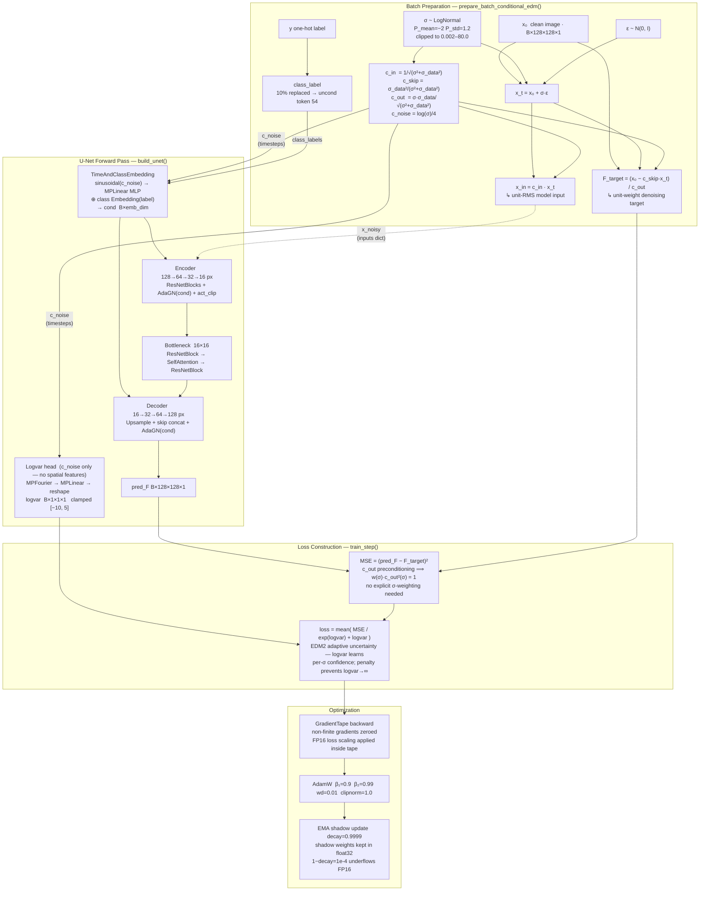

# Diffusion Training Flow

```mermaid
flowchart TD
    subgraph PREP["Batch Preparation — prepare_batch_conditional_edm()"]
        A1["x₀  clean image · B×128×128×1"]
        A2["σ ~ LogNormal\nP_mean=−2  P_std=1.2\nclipped to 0.002–80.0"]
        A3["ε ~ N(0, I)"]
        A4["y  one-hot label"]

        A1 & A2 & A3 --> xt["x_t = x₀ + σ·ε"]

        A2 --> sc["c_in  = 1/√(σ²+σ_data²)\nc_skip = σ_data²/(σ²+σ_data²)\nc_out  = σ·σ_data/√(σ²+σ_data²)\nc_noise = log(σ)/4"]

        xt & sc --> xin["x_in = c_in · x_t\n↳ unit-RMS model input"]
        A1 & xt & sc --> ft["F_target = (x₀ − c_skip·x_t) / c_out\n↳ unit-weight denoising target"]
        A4 --> cls["class_label\n10% replaced → uncond token 54"]
    end

    subgraph UNET["U-Net Forward Pass — build_unet()"]
        temb["TimeAndClassEmbedding\nsinusoidal(c_noise) → MPLinear MLP\n⊕ class Embedding(label)\n→ cond  B×emb_dim"]
        enc["Encoder  128→64→32→16 px\nResNetBlocks + AdaGN(cond) + act_clip"]
        bot["Bottleneck  16×16\nResNetBlock → SelfAttention → ResNetBlock"]
        dec["Decoder  16→32→64→128 px\nUpsample + skip concat + AdaGN(cond)"]
        pf["pred_F   B×128×128×1"]
        lv["Logvar head  (c_noise only — no spatial features)\nMPFourier → MPLinear → reshape\nlogvar  B×1×1×1   clamped [−10, 5]"]

        temb --> enc & dec
        enc --> bot --> dec --> pf
    end

    subgraph LOSS_BOX["Loss Construction — train_step()"]
        mse["MSE = (pred_F − F_target)²\nc_out preconditioning ⟹ w(σ)·c_out²(σ) = 1\nno explicit σ-weighting needed"]
        loss["loss = mean( MSE / exp(logvar) + logvar )\nEDM2 adaptive uncertainty — logvar learns\nper-σ confidence; penalty prevents logvar→∞"]
    end

    subgraph OPT["Optimization"]
        bwd["GradientTape backward\nnon-finite gradients zeroed\nFP16 loss scaling applied inside tape"]
        adamw["AdamW  β₁=0.9  β₂=0.99  wd=0.01  clipnorm=1.0"]
        ema_u["EMA shadow update  decay=0.9999\nshadow weights kept in float32\n1−decay=1e-4 underflows FP16"]
        bwd --> adamw --> ema_u
    end

    xin -. "x_noisy\n(inputs dict)" .-> enc
    sc -- "c_noise\n(timesteps)" --> temb & lv
    cls -- "class_labels" --> temb

    pf & ft --> mse
    lv & mse --> loss
    loss --> bwd
```
